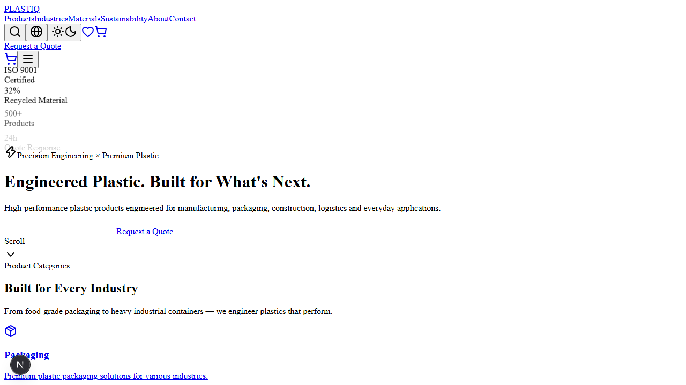

# PLASTIQ 🏭

> **Engineered Plastic. Built for What's Next.**

## Overview
PLASTIQ is a B2B plastics manufacturing application. We've completely redesigned the UI/UX using a modern, energetic, block-based design system that conveys industrial strength while remaining approachable and vibrant.

## Key Features
- **Vibrant Block-based UI:** Bold geometric shapes, high color contrast, and solid navy/grey with vibrant blue CTAs.
- **Next.js App Router:** High performance routing and server-side rendering.
- **i18n Support:** Full internationalization (English & Arabic).
- **Responsive Navigation:** Clean sticky navigation with Tailwind v4.

## Setup
`ash
npm install
npm run dev
`
